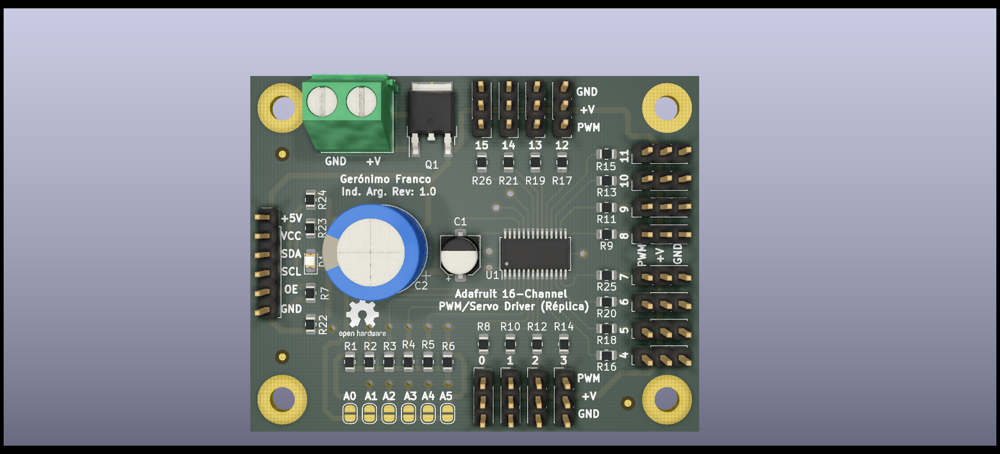

## Trabajo práctico final de la asignatura DCI ##
Este repositorio contiene el trabajo práctico final para la asignatura de Diseño de Circuitos Impresos de la carrera de posgrado de FIUBA.

* Autor: Geronimo, Franco Ezequiel
* Título corto del trabajo:  Replica Modulo Driver 16-Ch PWM con PCA9685
* Descripción:  El presente trabajo consiste en elaborar un nuevo diseño para el módulo Adafruit controlador de 16 canales PWM/Servos mediante I2C con el integrado PCA9685.
  
## Imagenes de la PCB ##

## Licencia de este trabajo ##
Esta obra está bajo una Licencia Creative Commons Atribución 4.0 Internacional. 2021

## Estructura del TP FINAL ##

Se propone y se pide utilizar la siguiente estructura.

* doc: Toda la información sobre el circuito, principalmente de autoría o procesamiento propio. Por ejemplo:
  * Notas de ingeniería propias.
  * Notas de aplicación propias.
  * Estudios previos, estado del arte, resumen de las investigaciones.
  * Notas con cálculos.
  * Dibujos adicionales.
  * Fotos de los prototipos.
  * Presupuestos, cotizaciones.
* info: Toda la iformación recolectada, principalmente de terceros, como por ejemplo:
  * Hojas de datos.
  * Notas de aplicación.
  * Info de productos comerciales.
  * Info en internet.
* pcb: Archivos de diseño esquemático y pcb.
